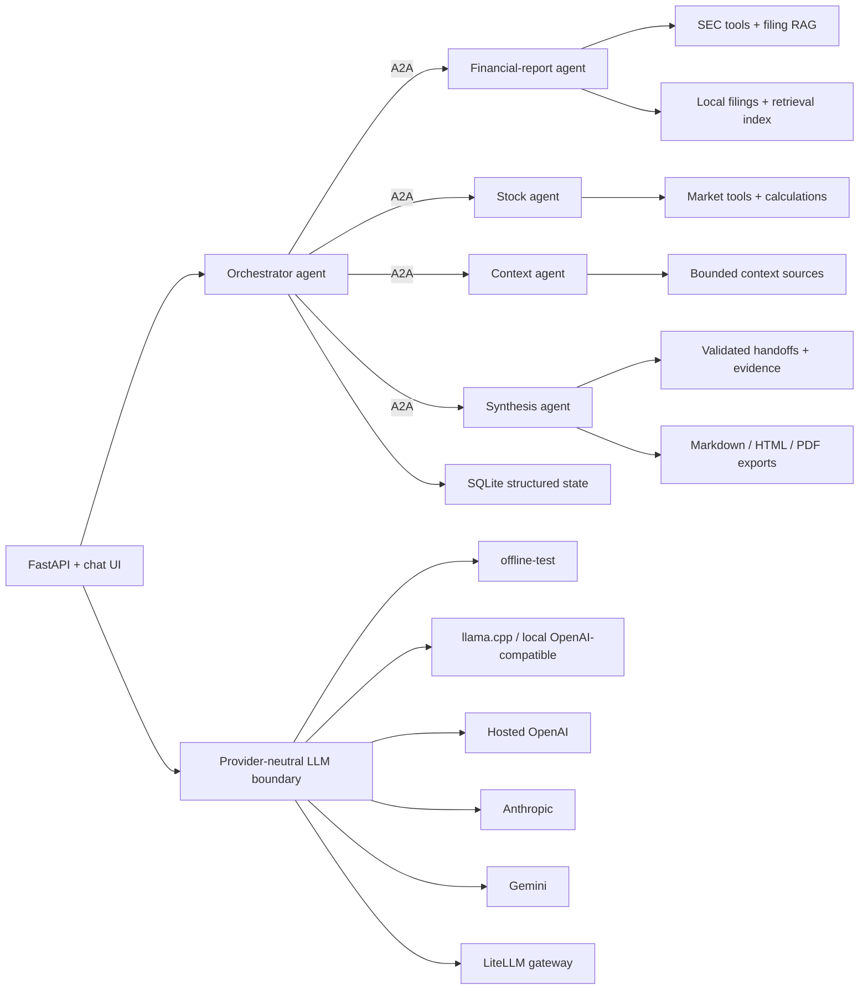

# Financial Research Agent

[](https://www.python.org/)
[](https://fastapi.tiangolo.com/)
[](https://docs.docker.com/compose/)
[](https://github.com/ggml-org/llama.cpp)
[](LICENSE)

Financial Research Agent is a local-first Python multi-agent system for company and stock
analysis. One orchestrator agent receives chat requests and delegates research through A2A to
financial-report, stock, context, and synthesis specialists. Each specialist owns its bounded
tools, data access, retrieval, and prompt contract.

The project is built for inspectability rather than autonomous trading. Deterministic research
remains the source of truth; LLM output is bounded, labeled, and kept separate from financial
evidence.

## Requirements

- Python 3.14
- Docker Desktop for container workflows
- Optional NVIDIA GPU support for the llama.cpp CUDA profile
- Alpha Vantage API key and an identifying SEC User-Agent for the live research scenario
- Optional provider credentials for OpenAI, Anthropic, or Gemini

## Quick Start

Start the complete credential-free local topology:

```powershell
docker compose up --build
```

Open [http://127.0.0.1:8000](http://127.0.0.1:8000). Compose starts the web/orchestrator
process and four internal A2A specialist services. Only the web UI is published to the host.
The default uses `offline-test` and downloads no model.

For direct Python development:

```powershell
python -m venv .venv
.\.venv\Scripts\Activate.ps1
python scripts/dev.py install
python scripts/dev.py run
```

CLI commands load `.env` from the repository root without overriding existing environment
variables. Start from `.env.example`; keep real credentials in `.env`, which is ignored by Git.

Local llama.cpp profiles:

```powershell
docker compose --profile cpu up --build -d
docker compose --profile cuda up --build -d
```

Use one profile at a time. First startup may download the selected GGUF model.
The Settings model control lists models reported by the connected provider; it is not a
free-text model field. `docker compose up` without a runtime profile intentionally remains
on `offline-test`.

## Demo

The versioned `novo-nordisk` scenario exercises one real-data path through entity resolution,
NVO and SPY market history, IFRS/DKK statements, SEC filings, specialist analysis, synthesis,
evidence, charts, and Markdown/HTML/PDF exports.

Configure `FRA_ALPHA_VANTAGE_API_KEY` and `FRA_SEC_USER_AGENT`, then run:

```powershell
python -m financial_research_agent scenario-run novo-nordisk --pretty
```

In the chat UI:

```text
/scenario novo-nordisk
/scenario novo-nordisk --with-local-qa
```

The second command adds one source-bounded local-LLM answer. It does not rewrite or change the
deterministic report.

## Architecture



Core boundaries:

- Provider-neutral async LLM contracts for chat, streaming, tools, structured output, and
  embeddings.
- A2A is the single internal transport between orchestrator and specialist agents.
- Specialist-owned tools and retrieval for data acquisition, analysis, evidence, and synthesis.
- SQLite for structured state; filesystem storage for source documents, vector indexes, caches,
  and immutable report exports.
- Local-first operation with loopback binding, environment-only secrets, and no shell tool.

Detailed diagrams and ownership boundaries are in [Architecture](docs/architecture.md).

## Current Status

Implemented:

- Persistent streamed chat with bounded context and `@company` entity references.
- SEC company lookup, CompanyFacts statements, and EDGAR HTML/TXT filing ingestion.
- Alpha Vantage daily market data with source metadata, pacing, and freshness warnings.
- Financial report, stock, and explicit company/macro/sector specialist analysis.
- Bounded orchestration, persisted handoffs, deterministic synthesis, evidence inspection, and
  local trace/debug views.
- Local vector retrieval and explicit cited answers over stored filing chunks.
- Immutable Markdown, self-contained HTML, and PDF report snapshots.
- SQLite migrations, integrity checks, backup, restore, cleanup, and guarded legacy JSON import.
- Offline evaluation harness, Docker packaging, local llama.cpp profiles, a canonical local A2A
  agent topology, and a bounded read-only MCP spike.
- Swappable OpenAI, Anthropic, Gemini, and LiteLLM provider adapters with explicit capability
  and credential status.
- One reproducible Novo Nordisk integration scenario. This demonstrates system integration, not
  general financial accuracy.

Intentional limitations:

- No buy/sell/hold recommendations, trading, broker integration, price targets, or alerts.
- No automatic news/macro ingestion, PDF extraction, or automatic RAG on every chat message.
- No remote A2A deployment claim, durable distributed queue, hosted telemetry, automatic
  provider fallback, or public benchmark claims.
- Market data may be delayed or provider-limited. SEC coverage is limited to SEC filers.
- Local LLM quality depends on the selected model, runtime, prompt budget, and hardware.

## Data And Trust

| Area | Primary source | Local handling |
| --- | --- | --- |
| Company identifiers | SEC company ticker data | SQLite + cache |
| Daily prices | Alpha Vantage | SQLite |
| Financial statements | SEC CompanyFacts | SQLite |
| Filings | SEC EDGAR submissions and archives | Metadata in SQLite; raw/text files locally |
| Context | Versioned, dated official-source snapshot | Package resource + persisted handoff |
| Reports | Persisted specialist handoffs | Immutable local exports |

External documents are treated as untrusted evidence, never as instructions. API keys stay in
environment variables. Runtime state lives under `FRA_HOME`, which defaults to
`~/.financial-research-agent`.

This software provides research tooling, not financial advice.

## Development

Common commands:

```powershell
python scripts/dev.py lint
python scripts/dev.py test
python scripts/dev.py check
python -m financial_research_agent eval --pretty
python -m financial_research_agent storage-check --full --pretty
```

`python scripts/dev.py check` runs docs validation, Ruff, tests, compilation, deterministic
evaluation, and package build.

## Documentation

- [Architecture](docs/architecture.md)

## License

Financial Research Agent is licensed under the [MIT License](LICENSE).
