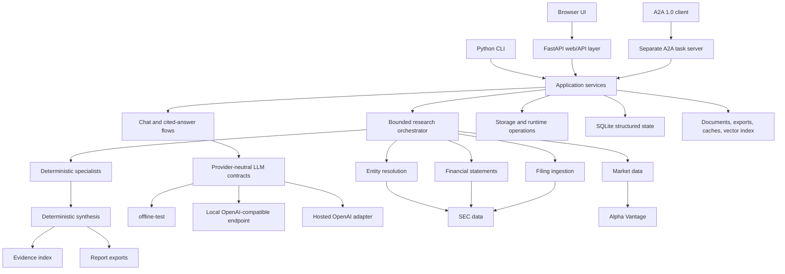
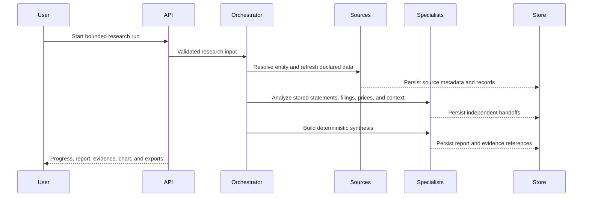

# Architecture

Financial Research Agent is a local-first Python application with explicit boundaries between
data acquisition, deterministic analysis, LLM reasoning, persistence, and presentation.

## System Overview

## Research Workflow

Each handoff has its own status, warnings, limitations, timestamps, and evidence IDs. A failed
specialist cannot produce a completed scenario result. Partial source coverage remains visible
instead of being silently converted into certainty.

## Package Ownership

| Package | Responsibility |
| --- | --- |
| `web` | FastAPI routes, request validation, chat sessions, and static UI |
| `llm` | Provider-neutral chat, streaming, tool, structured-output, and embedding contracts |
| `tools` | Guarded deterministic tool registry and function-calling loop |
| `entities` | Company/security identity resolution and identifier provenance |
| `market_data` | Daily prices, source metadata, pacing, metrics, and persistence boundary |
| `statements` | SEC CompanyFacts normalization and financial statement contracts |
| `filings` | SEC submissions, document download, extraction, chunking, and local files |
| `retrieval` | Local vector index and filing-chunk search |
| `reports` | Explicit cited-answer workflow and citation persistence |
| `report_analysis` | Financial statement and filing specialist |
| `stock_analysis` | Price, volume, trend, volatility, and benchmark specialist |
| `context_analysis` | Explicit source-linked company, macro, and sector context |
| `orchestration` | Bounded workflow, handoffs, progress, and run persistence |
| `synthesis` | Deterministic report sections, scenarios, confidence, and unknowns |
| `report_exports` | Canonical report document and immutable Markdown/HTML/PDF snapshots |
| `scenarios` | Reproducible integration profiles and acceptance checks |
| `persistence` | SQLite schema, migrations, repositories, backup, restore, and import |
| `observability` | Redacted traces, stored-result replay plans, and debug bundles |
| `evaluation` | Offline deterministic evaluation contracts and fixtures |
| `a2a` | Optional A2A 1.0 Agent Card, task execution, SSE, redaction, and SQLite task store |

## Deterministic And LLM Boundaries

Deterministic code owns:

- Provider calls, validation, identifiers, timestamps, data freshness, and source attribution.
- Financial calculations, filing chunking, retrieval scores, specialist handoffs, synthesis
  structure, evidence resolution, and report exports.
- Scenario acceptance checks and no-advice framing.

LLMs may:

- Answer direct chat requests.
- Produce source-bounded cited answers when explicitly requested.
- Participate in guarded tool-calling through declared tool schemas.
- Produce one optional source-marker-based scenario answer.

LLMs do not determine whether source data exists, rewrite the deterministic report, invent
citations, or control scenario completion.

## Persistence And Data Flow

SQLite stores normalized IDs, relations, statuses, timestamps, searchable fields, and
versioned payloads. This covers companies, securities, sessions, messages, market series,
statements, filings, citations, research runs, handoffs, jobs, A2A tasks/events, and runtime
settings.

Large or append-only artifacts remain files:

- Raw SEC documents and extracted filing text.
- Report export snapshots.
- Local vector index and embedding cache.
- Provider caches, backups, and logs.

`FRA_HOME` is the root of this trust boundary. Backups and restore operations are guarded;
schema migrations are checksummed; secrets are never written by the settings UI.

## Local Trust Boundary

The app binds to loopback by default. Docker publishes app and model ports on loopback. Remote
binding requires explicit opt-in and is not a production deployment model.

External source text is untrusted. It is escaped in exports, framed as evidence in prompts, and
never grants tool permissions. Tools are allowlisted by name and permission. There is no shell,
arbitrary code execution, or unrestricted filesystem tool.

The optional A2A service is a separate process on port `8001`. It exposes one generic
`company_research` skill over A2A 1.0 HTTP+JSON/REST and SSE, maps requests to the existing
orchestrator, and persists task events in SQLite. It is disabled and loopback-only by default.
Remote binding additionally requires an environment-only Bearer key and a trusted TLS reverse
proxy. Push notifications, gRPC, JSON-RPC, and public deployment are unsupported.

The main web process no longer owns A2A discovery. Its interoperability endpoint remains a
bounded read-only MCP-style status spike.
