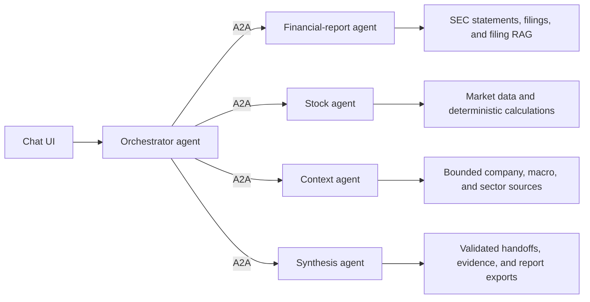
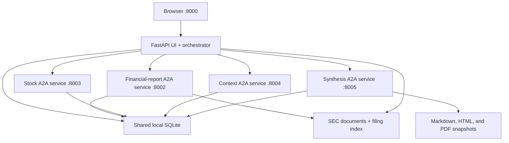

# Architecture

Financial Research Agent uses one research path. The chat UI talks to an orchestrator agent.
Research work is delegated over A2A to four domain specialists. There is no single-process versus
distributed runtime switch.

## Agent Topology

The orchestrator owns request interpretation, company resolution, planning, delegation, progress,
cancellation, and the canonical research run. It does not perform specialist analysis.

Specialist ownership:

- Financial-report agent fetches SEC statements and filings, then analyzes stored statements and
  filing evidence.
- Stock agent fetches company and benchmark prices, then computes deterministic market metrics.
- Context agent analyzes explicit source-linked company, macro, and sector context. Automatic news
  ingestion is not implemented.
- Synthesis agent consumes persisted specialist handoffs and creates the deterministic report.

Specialist handoffs always contain status, timestamps, warnings, limitations, confidence, and
evidence IDs. Failed A2A work remains visible and produces partial or failed research. No hidden
in-process fallback runs in the normal application topology.

## Runtime

`docker compose up` starts the complete topology. Only port `8000` is published. Specialist ports
remain on the Compose network. CPU and CUDA profiles add one llama.cpp service but do not change
the agent topology.

The shared SQLite/filesystem design is bounded local infrastructure. Multi-host deployment would
require a durable queue, remote database, object storage, service authentication, TLS, and
observability. This repository does not claim those production properties.

## Deterministic And LLM Boundaries

Deterministic code owns:

- Provider calls, identifiers, source metadata, freshness, validation, and persistence.
- Financial calculations, filing chunking, retrieval scores, handoff validation, report structure,
  evidence resolution, and exports.
- Completion status, limitations, no-advice framing, and scenario acceptance checks.

LLMs may answer direct chat, create explicitly source-bounded answers, and use guarded declared
tools. LLMs do not invent source availability, rewrite the deterministic report, control completion
status, or grant themselves data/tool permissions.

## Persistence

SQLite stores structured entities, chat, source metadata, research runs, handoffs, A2A tasks,
delegations, background jobs, and runtime settings. The filesystem stores raw SEC documents,
extracted text, vector indexes, caches, backups, logs, and immutable report exports.

`FRA_HOME` is the local trust boundary. Credentials remain environment-only. External documents
are untrusted evidence, never instructions. The application exposes no shell or unrestricted
filesystem tool.

## Package Ownership

| Package | Responsibility |
| --- | --- |
| `web` | FastAPI API, chat sessions, progress, and static UI |
| `orchestration` | Orchestrator contracts, plan, delegation, and canonical run |
| `a2a` | Agent Cards, task execution, dispatcher, retry/cancellation, and specialist services |
| `entities` | Company and security resolution |
| `statements`, `filings`, `retrieval`, `report_analysis` | Financial-report agent data and analysis |
| `market_data`, `stock_analysis` | Stock agent data and analysis |
| `context_analysis` | Context agent analysis |
| `synthesis`, `report_exports` | Deterministic synthesis and immutable exports |
| `llm`, `tools`, `agents` | Provider abstraction, guarded tools, and prompt contracts |
| `persistence`, `storage` | SQLite, migrations, files, backup, restore, and cleanup |
