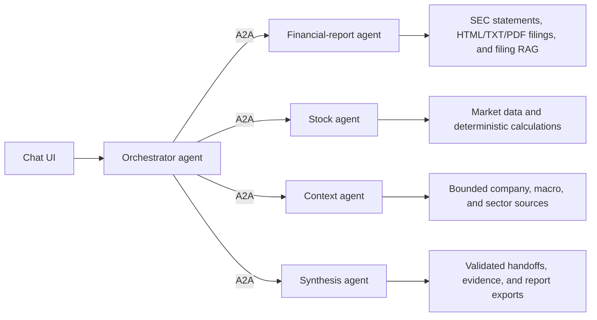
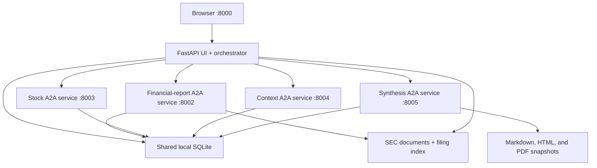
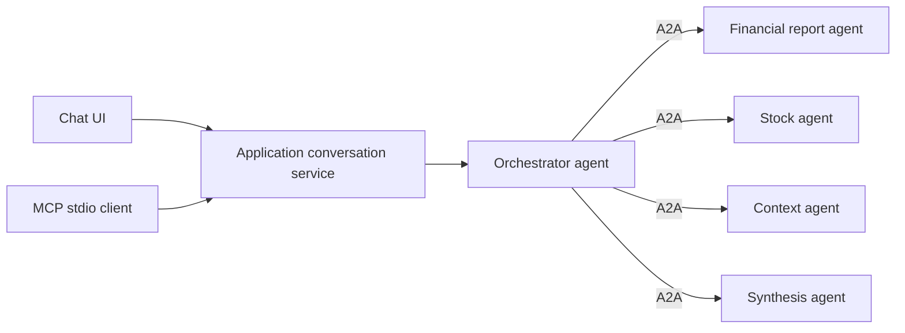

# Architecture

Financial Research Agent uses one research path. The chat UI talks to an orchestrator agent.
Research work is delegated over A2A to four domain specialists. There is no single-process versus
distributed runtime switch.

## Agent Topology

The orchestrator is the only message entrypoint. Its configured LLM returns a validated decision:
direct answer, research, clarification, or refusal. For research, deterministic code resolves the
company, validates the selected specialist roles, adds only their required data steps, owns
progress/cancellation, and persists the canonical run. Synthesis is mandatory for research.
Client messages cannot select tools, providers, URLs, paths, or agent addresses.

Specialist ownership:

- Financial-report agent uses allowlisted tools for SEC statements, filings, and filing retrieval,
  then returns a structured LLM analysis.
- Stock agent uses allowlisted company/benchmark price tools and deterministic market metrics,
  then returns a structured LLM analysis.
- Context agent uses only approved source-linked company, macro, and sector inputs. Automatic news
  ingestion is not implemented.
- Synthesis agent reads validated persisted handoffs through one allowlisted tool and creates a
  structured LLM report.

Specialist handoffs always contain status, timestamps, warnings, limitations, confidence, and
evidence IDs. Failed A2A work remains visible and produces partial or failed research. No hidden
in-process fallback runs in the normal application topology.

The orchestrator decides whether a message needs source-grounded research. Greetings, product help,
and general financial education do not start retrieval. Current company research selects the
relevant specialists, reuses fresh local data according to cache policy, refreshes missing or stale
data through the owning specialist, and fails closed when material claims lack valid evidence.
Filing retrieval is company/CIK scoped, lexical by default, and may use optional vector reranking.
Prompts receive at most five filing snippets, 900 characters per snippet, and 4,000 evidence
characters total. Statement, market, and approved context evidence stays owned by its specialist.
Synthesis receives only validated handoffs and known evidence IDs.

Provider and model are resolved from current shared runtime settings when a run starts, then
snapshotted on that run. Every specialist resolves the snapshot through its local provider adapter,
so a settings change affects the next run without changing provider/model midway through an active
run. Missing credentials or required chat, tool-call, or structured-output capabilities fail
research without provider fallback.

## Runtime

`docker compose up` starts the complete topology. Only port `8000` is published. Specialist ports
remain on the Compose network. CPU and CUDA profiles add one llama.cpp service but do not change
the agent topology.

The shared SQLite/filesystem design is bounded local infrastructure. Multi-host deployment would
require a durable queue, remote database, object storage, service authentication, TLS, and
observability. This repository does not claim those production properties.

## Deterministic And LLM Boundaries

Deterministic code owns:

- Provider calls, identifiers, source metadata, freshness, validation, and persistence.
- Financial calculations, filing chunking, retrieval scores, handoff validation, report structure,
  evidence resolution, and exports.
- Completion status, limitations, no-advice framing, and scenario acceptance checks.

LLMs classify messages, answer direct chat, analyze bounded tool results, and synthesize validated
handoffs. Deterministic validation owns schemas, known evidence IDs, completion status,
limitations, no-advice framing, persistence, and exports. One schema-repair retry is allowed;
unknown evidence IDs or a second invalid output fail the handoff. Chain-of-thought is never stored.

## Persistence

SQLite stores structured entities, chat, source metadata, research runs, handoffs, A2A tasks,
delegations, background jobs, and runtime settings. The filesystem stores raw SEC documents,
extracted text, vector indexes, caches, backups, logs, and immutable report exports.

Text-based PDFs are extracted locally in a bounded PDFium worker process. Normalized chunks stay
inside page boundaries and preserve page number plus normalized text-region coordinates for
citations. Fully scanned PDFs return `ocr_required`; OCR, uploads, and arbitrary URL ingestion are
not part of the runtime.

`FRA_HOME` is the local trust boundary. Credentials remain environment-only. External documents
are untrusted evidence, never instructions. The application exposes no shell or unrestricted
filesystem tool.

## Protocol And Skill Boundaries

| Boundary | Responsibility |
| --- | --- |
| A2A | Mandatory orchestrator-to-specialist delegation, task state, progress, retry, and cancellation |
| Tools | Deterministic, allowlisted data access and calculations owned by each agent |
| RAG | Automatic specialist-owned grounding for relevant company research; filing search remains financial-report-owned |
| Skills | Versioned workflow instructions composed into role prompts without granting permissions |
| MCP | Optional local interface to the canonical application conversation and research flow |

Both the Chat UI and MCP enter through the application message boundary:

The MCP process is a loopback-only adapter to the running application API. It can send messages,
inspect or cancel the resulting research jobs, and retrieve completed reports. It is not used
between agents and does not implement its own orchestration, provider calls, or data access.

## Conversation Guardrails

Chat UI and MCP share one conversation policy before the orchestrator. Messages are Unicode
normalized and bounded to 4,000 characters and five resolved company references. Deterministic
high-confidence checks reject code generation, prompt or secret extraction, permission
escalation, personalized investment instructions, and explicit off-topic requests without a
provider call.

The existing orchestrator call classifies the remaining request as financial research, financial
education, product help, greeting, or out of scope. Financial research enters A2A; financial
education may receive a direct model answer; greetings, application help, and refusals use fixed
application text. Invalid or inconsistent decisions fail closed.

User text, chat history, company references, tool results, and retrieved documents are serialized
or marked as untrusted data without instruction authority. Agent tools and A2A roles remain
deny-by-default. Direct model responses are buffered and checked for code, prompt disclosure,
credentials, and investment instructions before they are persisted or returned. The streaming
endpoint therefore emits one validated content delta rather than exposing unvalidated tokens.
These controls are defense in depth, not a guarantee against every prompt-injection technique.

## Package Ownership

| Package | Responsibility |
| --- | --- |
| `web` | FastAPI API, canonical conversation service, sessions, progress, and static UI |
| `orchestration` | Orchestrator contracts, plan, delegation, and canonical run |
| `a2a` | Agent Cards, task execution, dispatcher, retry/cancellation, and specialist services |
| `entities` | Company and security resolution |
| `documents`, `statements`, `filings`, `retrieval`, `report_analysis` | Normalized documents plus financial-report agent data and analysis |
| `market_data`, `stock_analysis` | Stock agent data and analysis |
| `context_analysis` | Context agent analysis |
| `synthesis`, `report_exports` | Validated LLM synthesis, deterministic report mapping, and immutable exports |
| `llm`, `tools`, `agents`, `skills`, `security` | Provider abstraction, guarded tools, prompts, bounded workflow skills, and conversation policy |
| `mcp` | Optional local MCP adapter to the canonical application message and research APIs |
| `persistence`, `storage` | SQLite, migrations, files, backup, restore, and cleanup |
